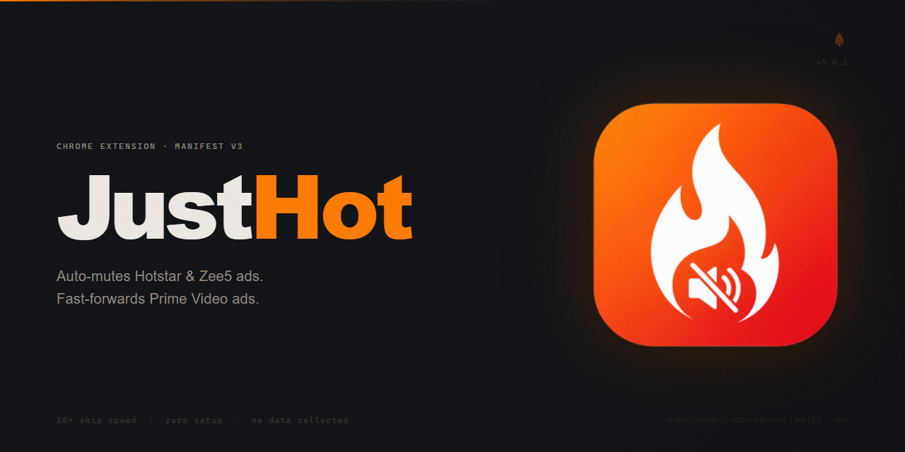

  
  <h1>JustHot</h1>
  
<strong>Auto-mutes Hotstar &amp; Zee5 ads. Fast-forwards Prime Video ads. So you never have to lose your cool.</strong>

  
  
  

---

## Product details

JustHot is a lightweight Chrome extension (Manifest V3) built for streaming viewers who are tired of ad interruptions. It runs silently in the background — no accounts, no setup, no data collection.

- **Version:** 5.1.0
- **Size:** < 50 KB
- **Platform:** Google Chrome (Manifest V3)

### Browser compatibility

| Browser | Works? | Notes |
|---------|--------|-------|
| Chrome | ✅ Yes | Primary platform |
| Edge | ✅ Yes | Install directly from Chrome Web Store |
| Brave | ✅ Yes | Install directly from Chrome Web Store |
| Opera | ✅ Yes | Enable "Install Chrome Extensions" first |
| Vivaldi | ✅ Yes | Chrome extensions work out of the box |
| Firefox | 🚧 WIP | Coming soon.. |
| Safari | 🚧 WIP | Coming soon... |

---

## Logo and brand identity

| Asset | Usage |
|-------|-------|
|  | Active state (both or either platform enabled) |
|  | Inactive state (all platforms off) |

Primary color: `#ff7a00` — used for the active toggle pill and brand accent.  
Background: `#0f1014` — deep dark, easy on the eyes during night matches.

---

## Features

### Hotstar — Live Match Ad Muting
- Detects ad breaks in real time using Hotstar's ad-impression tracking signal
- Mutes the browser tab the instant an ad starts
- Unmutes automatically when the match resumes
- Parses ad duration from the tracking URL for precise timing

### Zee5 — Ad Muting

- Detects ad breaks in real time using DOM signals in the Zee5 player
- Mutes the video the instant an ad starts
- Unmutes automatically when content resumes
- Works despite Zee5's SSAI architecture (AWS MediaTailor server-side ad stitching)

### Prime Video — Ad Fast-Forward
- Detects Prime Video ad UI using DOM selectors and text patterns
- Speeds through ads at 16× playback (muted)
- Clicks visible skip buttons automatically
- Restores original playback speed and audio the moment the show resumes

### Independent Controls
Each platform has its own On/Off toggle — enabling one does not affect the other.

---

## Support and queries

Found a bug? Ad slipping through? Feature idea?

Reach out at **[feelfreewithnu@gmail.com](mailto:feelfreewithnu@gmail.com)**

Please include:
- Browser version
- Which platform (Hotstar / Prime Video)
- What happened vs. what you expected

---

## Open source policy

JustHot is open source under the [MIT License](LICENSE). You are free to use, study, and fork this code. The source is published for transparency — particularly so users and reviewers can verify that no data is collected or transmitted.

This is a personal project, not a company product. Contributions are welcome but selective — see below.

---

## Contribution and selection policy

Pull requests are reviewed and merged at the maintainer's discretion. To keep things focused:

**Will consider:**
- Bug fixes with clear reproduction steps
- Improved ad detection selectors for Hotstar or Prime Video
- Performance improvements with measurable impact

**Out of scope:**
- Adding new platforms (for now)
- UI redesigns
- Feature additions not discussed in an issue first

**How to contribute:**
1. Open an issue first — describe the problem or idea
2. Wait for maintainer acknowledgment before writing code
3. Fork, make changes, open a PR referencing the issue
4. All PRs require review approval before merge

---

## Privacy policy

JustHot collects **no user data**. The only local storage used is your on/off toggle preference per platform — it never leaves your device.

Full details: [PRIVACY.md](PRIVACY.md)

---

  

---

  © 2026 NUBEGINNINGS INDIA PRIVATE LIMITED · MIT License

